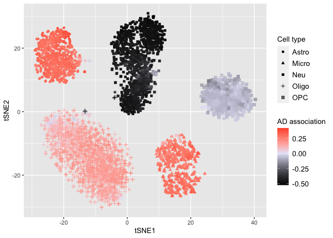

# Load required packages

    library(DEGAS)
    library(Rtsne)

    ## Warning: package 'Rtsne' was built under R version 4.0.2

    library(ggplot2)

    ## Warning: package 'ggplot2' was built under R version 4.0.2

# Load data

    scDat = read.csv('scDat.csv',row.names=1)
    scLab = read.csv('scLab.csv',row.names=1)
    patDat = read.csv('patDat.csv',row.names=1)
    patLab = read.csv('patLab.csv',row.names=1)

# Initialize DEGAS framework

    path.data = ''
    path.result = ''
    initDEGAS()
    tmpDir = paste0(path.result, 'tmp/')

# Training DEGAS model

    ccModel1 = runCCMTLBag(scDat,scLab,patDat,patLab,tmpDir,'ClassClass','DenseNet',3,5)

    ## 0
    ## 0
    ## 0
    ## 0
    ## 0

# Predictions from DEGAS model

    # Predicting patient outcome in cells
    # ie, predicting AD association in individual cells
    scpatPreds = predClassBag(ccModel1,scDat,'pat')
    colnames(scpatPreds) = colnames(patLab)

# Displaying single cells overlaid with AD impressions

    # Set seed and run tSNE
    set.seed(1)
    scDat_tsne = Rtsne(scDat)
    colnames(scDat_tsne$Y) = c('tSNE1','tSNE2')
    # kNN smoothing of AD association
    impressions_sc_smooth = knnSmooth(scpatPreds[,"AD"],scDat_tsne$Y)
    # Conversion of AD association to correlation
    impressions_sc_smooth_cor = toCorrCoeff(impressions_sc_smooth)
    tmp = data.frame(tSNE1=scDat_tsne$Y[,"tSNE1"],tSNE2=scDat_tsne$Y[,"tSNE2"],
                     Dis=impressions_sc_smooth_cor,CT=fromOneHot(scLab))
    p = ggplot(tmp,aes(x=tSNE1,y=tSNE2,color=Dis,shape=CT))+ geom_point() + 
              scale_color_gradient2(low = "black",mid="lavender",high="red")
    plot(p+labs(color='AD association',shape='Cell type') +
           theme(legend.title=element_text(size=rel(1)),
                 legend.text=element_text(size=rel(1)),
                 axis.title=element_text(size=rel(1)),
                 axis.text.x=element_text(size=rel(1)),
                 axis.text.y=element_text(size=rel(1))))

# Session Info

    sessionInfo()

    ## R version 4.0.1 (2020-06-06)
    ## Platform: x86_64-apple-darwin17.0 (64-bit)
    ## Running under: macOS Catalina 10.15.7
    ## 
    ## Matrix products: default
    ## BLAS:   /Library/Frameworks/R.framework/Versions/4.0/Resources/lib/libRblas.dylib
    ## LAPACK: /Library/Frameworks/R.framework/Versions/4.0/Resources/lib/libRlapack.dylib
    ## 
    ## locale:
    ## [1] en_US.UTF-8/en_US.UTF-8/en_US.UTF-8/C/en_US.UTF-8/en_US.UTF-8
    ## 
    ## attached base packages:
    ## [1] stats     graphics  grDevices utils     datasets  methods   base     
    ## 
    ## other attached packages:
    ## [1] ggplot2_3.3.5 Rtsne_0.15    DEGAS_0.1.0  
    ## 
    ## loaded via a namespace (and not attached):
    ##  [1] Rcpp_1.0.7        highr_0.9         pillar_1.6.2      compiler_4.0.1   
    ##  [5] tools_4.0.1       digest_0.6.27     evaluate_0.14     lifecycle_1.0.0  
    ##  [9] tibble_3.1.3      gtable_0.3.0      pkgconfig_2.0.3   rlang_0.4.11     
    ## [13] DBI_1.1.1         yaml_2.2.1        xfun_0.25         withr_2.4.2      
    ## [17] stringr_1.4.0     dplyr_1.0.7       knitr_1.33        generics_0.1.0   
    ## [21] vctrs_0.3.8       grid_4.0.1        tidyselect_1.1.1  glue_1.4.2       
    ## [25] R6_2.5.0          fansi_0.5.0       rmarkdown_2.10    purrr_0.3.4      
    ## [29] farver_2.1.0      magrittr_2.0.1    scales_1.1.1      ellipsis_0.3.2   
    ## [33] htmltools_0.5.1.1 assertthat_0.2.1  colorspace_2.0-2  labeling_0.4.2   
    ## [37] utf8_1.2.2        stringi_1.7.3     munsell_0.5.0     crayon_1.4.1
