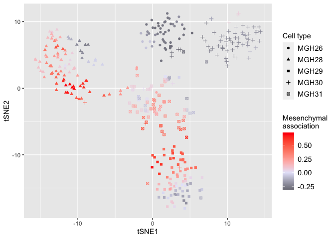
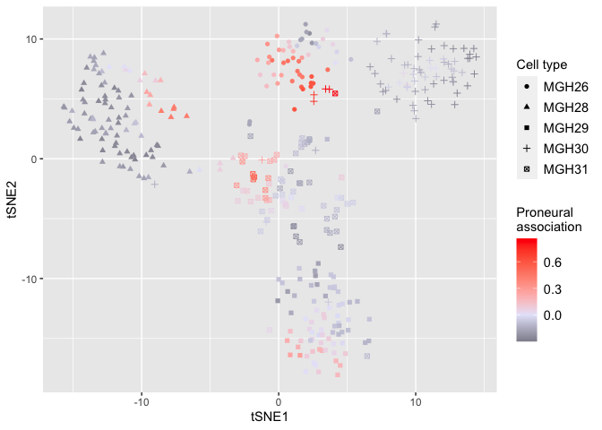
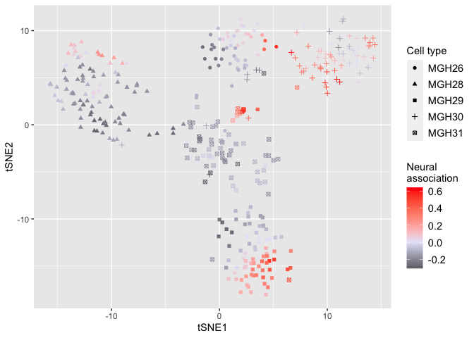
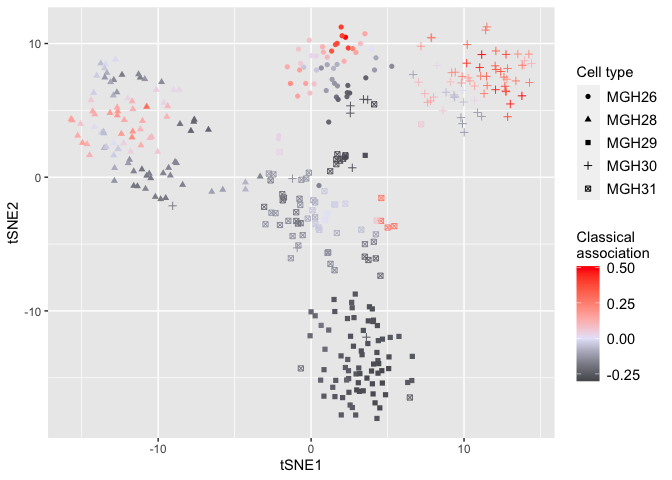

Load required packages
======================

    library(DEGAS)
    library(Rtsne)
    library(ggplot2)

    ## Warning: package 'ggplot2' was built under R version 3.5.2

Load data
=========

    scDat = read.csv('scDat.csv',row.names=1)
    patDat = read.csv('patDat.csv',row.names=1)
    patLab = read.csv('patLab.csv',row.names=1)

Initialize DEGAS framework
==========================

    path.data = ''
    path.result = ''
    initDEGAS()
    set_seed_term(2)
    tmpDir = 'tmp/'

Training DEGAS model
====================

    ccModel1 = runCCMTLBag(scDat,NULL,patDat,patLab,tmpDir,'BlankClass','DenseNet',3,5)

    ## 3-layer DenseNet BlankClass DEGAS model

    ## 0

    ## 3-layer DenseNet BlankClass DEGAS model

    ## 0

    ## 3-layer DenseNet BlankClass DEGAS model

    ## 0

    ## 3-layer DenseNet BlankClass DEGAS model

    ## 0

    ## 3-layer DenseNet BlankClass DEGAS model

    ## 0

Predictions from DEGAS model
============================

    # Predicting patient outcome in cells
    # ie, predicting GBM subtype association in individual cells
    scpatPreds = predClassBag(ccModel1,scDat,'pat')
    colnames(scpatPreds) = colnames(patLab)

Displaying single cells overlaid with GBM subtype impressions
=============================================================

    # Set seed and run tSNE
    set.seed(1)
    scDat_tsne = Rtsne(scDat)
    colnames(scDat_tsne$Y) = c('tSNE1','tSNE2')
    # kNN smoothing of GBM subtype association
    impressions_sc_smooth = knnSmooth(scpatPreds,scDat_tsne$Y)
    # Conversion of GBM subtype association to correlation
    impressions_sc_smooth_cor = toCorrCoeff(impressions_sc_smooth)
    tmp = data.frame(tSNE1=scDat_tsne$Y[,"tSNE1"],tSNE2=scDat_tsne$Y[,"tSNE2"],
                     Proneural=impressions_sc_smooth_cor[,"Proneural"],
                     Neural=impressions_sc_smooth_cor[,"Neural"],
                     Classical=impressions_sc_smooth_cor[,"Classical"],
                     Mesenchymal=impressions_sc_smooth_cor[,"Mesenchymal"],
                     Patient=sub("[_].*","",rownames(scDat)))
    # Mesenchymal
    p = ggplot(tmp,aes(x=tSNE1,y=tSNE2,color=Mesenchymal,shape=Patient))+ geom_point() + 
              scale_color_gradient2(low = "black",mid="lavender",high="red")
    plot(p+labs(color='Mesenchymal\nassociation',shape='Patient') +
           theme(legend.title=element_text(size=rel(1)),
                 legend.text=element_text(size=rel(1)),
                 axis.title=element_text(size=rel(1)),
                 axis.text.x=element_text(size=rel(1)),
                 axis.text.y=element_text(size=rel(1))))

    # Proneural
    p = ggplot(tmp,aes(x=tSNE1,y=tSNE2,color=Proneural,shape=Patient))+ geom_point() + 
              scale_color_gradient2(low = "black",mid="lavender",high="red")
    plot(p+labs(color='Proneural\nassociation',shape='Patient') +
           theme(legend.title=element_text(size=rel(1)),
                 legend.text=element_text(size=rel(1)),
                 axis.title=element_text(size=rel(1)),
                 axis.text.x=element_text(size=rel(1)),
                 axis.text.y=element_text(size=rel(1))))

    # Neural
    p = ggplot(tmp,aes(x=tSNE1,y=tSNE2,color=Neural,shape=Patient))+ geom_point() + 
              scale_color_gradient2(low = "black",mid="lavender",high="red")
    plot(p+labs(color='Neural\nassociation',shape='Patient') +
           theme(legend.title=element_text(size=rel(1)),
                 legend.text=element_text(size=rel(1)),
                 axis.title=element_text(size=rel(1)),
                 axis.text.x=element_text(size=rel(1)),
                 axis.text.y=element_text(size=rel(1))))

    # Classical
    p = ggplot(tmp,aes(x=tSNE1,y=tSNE2,color=Classical,shape=Patient))+ geom_point() + 
              scale_color_gradient2(low = "black",mid="lavender",high="red")
    plot(p+labs(color='Classical\nassociation',shape='Patient') +
           theme(legend.title=element_text(size=rel(1)),
                 legend.text=element_text(size=rel(1)),
                 axis.title=element_text(size=rel(1)),
                 axis.text.x=element_text(size=rel(1)),
                 axis.text.y=element_text(size=rel(1))))

Session Info
============

    sessionInfo()

    ## R version 3.5.1 (2018-07-02)
    ## Platform: x86_64-apple-darwin15.6.0 (64-bit)
    ## Running under: macOS  10.14.5
    ## 
    ## Matrix products: default
    ## BLAS: /Library/Frameworks/R.framework/Versions/3.5/Resources/lib/libRblas.0.dylib
    ## LAPACK: /Library/Frameworks/R.framework/Versions/3.5/Resources/lib/libRlapack.dylib
    ## 
    ## locale:
    ## [1] en_US.UTF-8/en_US.UTF-8/en_US.UTF-8/C/en_US.UTF-8/en_US.UTF-8
    ## 
    ## attached base packages:
    ## [1] stats     graphics  grDevices utils     datasets  methods   base     
    ## 
    ## other attached packages:
    ## [1] ggplot2_3.3.0 Rtsne_0.15    DEGAS_0.1.0  
    ## 
    ## loaded via a namespace (and not attached):
    ##  [1] Rcpp_1.0.4.6     knitr_1.28       magrittr_1.5     tidyselect_1.0.0
    ##  [5] munsell_0.5.0    colorspace_1.4-1 R6_2.4.1         rlang_0.4.5     
    ##  [9] dplyr_0.8.5      stringr_1.4.0    tools_3.5.1      grid_3.5.1      
    ## [13] gtable_0.3.0     xfun_0.14        withr_2.2.0      htmltools_0.4.0 
    ## [17] ellipsis_0.3.0   assertthat_0.2.1 yaml_2.2.1       digest_0.6.25   
    ## [21] tibble_3.0.1     lifecycle_0.2.0  crayon_1.3.4     farver_2.0.3    
    ## [25] purrr_0.3.4      vctrs_0.2.4      glue_1.4.1       evaluate_0.14   
    ## [29] rmarkdown_2.1    labeling_0.3     stringi_1.4.6    compiler_3.5.1  
    ## [33] pillar_1.4.4     scales_1.1.1     pkgconfig_2.0.3
