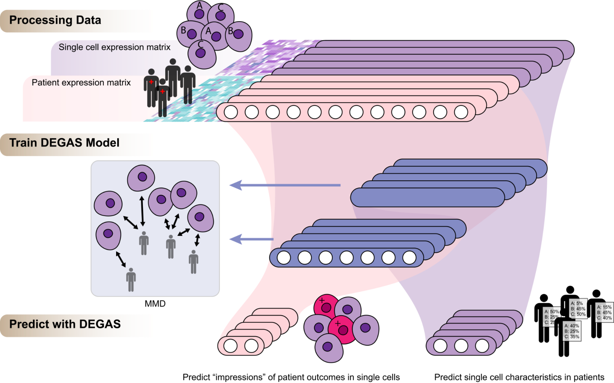

# DEGAS: A transfer learning framework to infer impressions of cellular and patient phenotypes between patients and single cells

[](LICENSE)



## Installation
* Step 1 Install python3, pip3, and Tensorflow from terminal
```bash
pip3 install tensorflow
```

* Step 2 Install devtools in R
```R
install.packages("devtools")
```
* Step 3 Install DEGAS in R
```R
library(devtools)
install_github("tsteelejohnson91/DEGAS")
```

## Prerequisites

### OS
* OSX
* Linux
* Windows (coming soon)

### Python packages
* Tensorflow
* functools
* numpy
* math

### R
* None required

## Configurations tested

### Mac CPU
* R (4.0.1), Python (3.8.2), TensorFlow (2.3.1)
* R (4.1.0), Python (3.8.3), TensorFlow (2.5.0)
* R (3.5.1), Python (3.6.0), TensorFlow (2.3.1)

### Linux GPU
* R (3.4.4), Python (anaconda 3.6.5), TensorFlow GPU-enabled (1.9.0)
