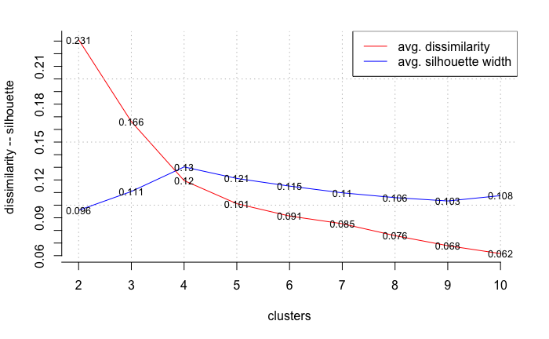
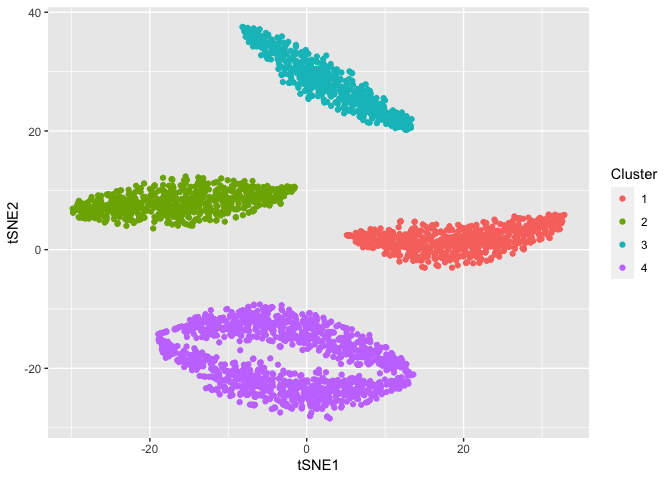
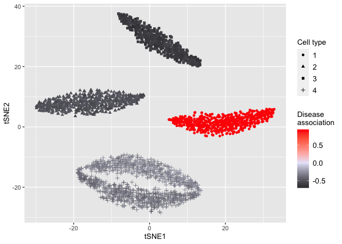
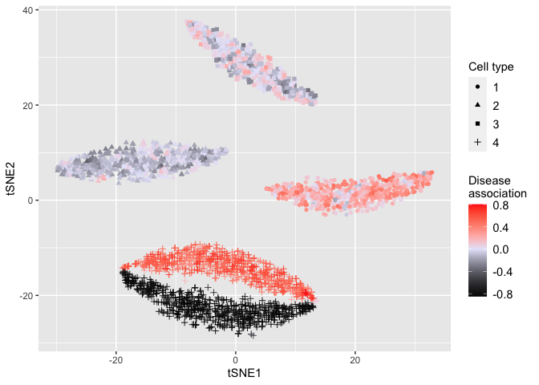

# Load required packages

    library(DEGAS)
    library(Rtsne)

    ## Warning: package 'Rtsne' was built under R version 4.0.2

    library(ggplot2)

    ## Warning: package 'ggplot2' was built under R version 4.0.2

    library(ClusterR)

    ## Warning: package 'ClusterR' was built under R version 4.0.2

    ## Loading required package: gtools

# Load data

    scCounts = read.csv('scCounts.csv',row.names=1)
    patCountsSim1 = read.csv('patCountsSim1.csv',row.names=1)
    patCountsSim2 = read.csv('patCountsSim2.csv',row.names=1)
    patCountsSim3 = read.csv('patCountsSim3.csv',row.names=1)
    patLab = read.csv('patLab.csv',row.names=1)

# Finding optimal cluster number

    set.seed(2)
    scCounts.tsne = Rtsne(t(log2(scCounts+1)))
    opt_Med = Optimal_Clusters_Medoids(scCounts.tsne$Y, max_clusters = 10, criterion = "silhouette",distance_metric="euclidean")

    ##   
    ## Based on the plot give the number of clusters (greater than 1) that you consider optimal?

    ## Warning: The plot can not be created for the specified number of clusters. This
    ## means the output data do not fit in the figure (plot) margins.

    # User enter 4 since average silhouette width is highest at 4
    

# Defining clusters and plotting

    clusts = Cluster_Medoids(scCounts.tsne$Y, clusters = 4, swap_phase = TRUE, verbose = F)
    outputs = data.frame(tSNE1=scCounts.tsne$Y[,1],tSNE2=scCounts.tsne$Y[,2],Cluster=factor(clusts$clusters))
    ggplot(outputs,aes(x=tSNE1,y=tSNE2,color=Cluster)) + geom_point()

# Normalizing and Standardizing data

    # Generating single cell label matrix
    scLab = toOneHot(clusts$clusters)
    scDat = preprocessCounts(scCounts)
    patDatSim1 = preprocessCounts(patCountsSim1)
    patDatSim2 = preprocessCounts(patCountsSim2)
    patDatSim3 = preprocessCounts(patCountsSim3)

# Initialize DEGAS framework

    path.data = ''
    path.result = ''
    initDEGAS()
    tmpDir = paste0(path.result, 'tmp/')

# Training DEGAS models for each simulation

    set_seed_term(2)
    ccModelSim1 = runCCMTLBag(scDat,scLab,patDatSim1,patLab,tmpDir,'ClassClass','DenseNet',3,5)

    ## 3-layer DenseNet ClassClass DEGAS model

    ## 0

    ## 3-layer DenseNet ClassClass DEGAS model

    ## 0

    ## 3-layer DenseNet ClassClass DEGAS model

    ## 0

    ## 3-layer DenseNet ClassClass DEGAS model

    ## 0

    ## 3-layer DenseNet ClassClass DEGAS model

    ## 0

    set_seed_term(2)
    ccModelSim2 = runCCMTLBag(scDat,scLab,patDatSim2,patLab,tmpDir,'ClassClass','DenseNet',3,5)

    ## 3-layer DenseNet ClassClass DEGAS model
    ## 0

    ## 3-layer DenseNet ClassClass DEGAS model

    ## 0

    ## 3-layer DenseNet ClassClass DEGAS model

    ## 0

    ## 3-layer DenseNet ClassClass DEGAS model

    ## 0

    ## 3-layer DenseNet ClassClass DEGAS model

    ## 0

    set_seed_term(2)
    ccModelSim3 = runCCMTLBag(scDat,scLab,patDatSim3,patLab,tmpDir,'ClassClass','DenseNet',3,5)

    ## 3-layer DenseNet ClassClass DEGAS model
    ## 0

    ## 3-layer DenseNet ClassClass DEGAS model

    ## 0

    ## 3-layer DenseNet ClassClass DEGAS model

    ## 0

    ## 3-layer DenseNet ClassClass DEGAS model

    ## 0

    ## 3-layer DenseNet ClassClass DEGAS model

    ## 0

# Predictions from DEGAS model for each simulation

    # Predicting patient outcome in cells
    # ie, predicting AD association in individual cells
    scpatPredsSim1 = predClassBag(ccModelSim1,scDat,'pat')
    colnames(scpatPredsSim1) = colnames(patLab)
    scpatPredsSim2 = predClassBag(ccModelSim2,scDat,'pat')
    colnames(scpatPredsSim2) = colnames(patLab)
    scpatPredsSim3 = predClassBag(ccModelSim3,scDat,'pat')
    colnames(scpatPredsSim3) = colnames(patLab)

# Displaying single cells overlaid with AD impressions

    # kNN smoothing of disease association
    impressions_sc_smooth_sim1 = knnSmooth(scpatPredsSim1[,"D"],scCounts.tsne$Y)
    impressions_sc_smooth_sim2 = knnSmooth(scpatPredsSim2[,"D"],scCounts.tsne$Y)
    impressions_sc_smooth_sim3 = knnSmooth(scpatPredsSim3[,"D"],scCounts.tsne$Y)
    # Conversion of disease association to correlation
    impressions_sc_smooth_cor_sim1 = toCorrCoeff(impressions_sc_smooth_sim1)
    impressions_sc_smooth_cor_sim2 = toCorrCoeff(impressions_sc_smooth_sim2)
    impressions_sc_smooth_cor_sim3 = toCorrCoeff(impressions_sc_smooth_sim3)
    tmp = data.frame(tSNE1=scCounts.tsne$Y[,1],tSNE2=scCounts.tsne$Y[,2],
                     DisSim1=impressions_sc_smooth_cor_sim1,
                     DisSim2=impressions_sc_smooth_cor_sim2,
                     DisSim3=impressions_sc_smooth_cor_sim3,
                     CT=fromOneHot(scLab))
    # Plotting disease assoiations for simulaiton 1
    p = ggplot(tmp,aes(x=tSNE1,y=tSNE2,color=DisSim1,shape=CT))+ geom_point() + 
              scale_color_gradient2(low = "black",mid="lavender",high="red")
    plot(p+labs(color='Disease\nassociation',shape='Cell type') +
           theme(legend.title=element_text(size=rel(1)),
                 legend.text=element_text(size=rel(1)),
                 axis.title=element_text(size=rel(1)),
                 axis.text.x=element_text(size=rel(1)),
                 axis.text.y=element_text(size=rel(1))))

    p = ggplot(tmp,aes(x=tSNE1,y=tSNE2,color=DisSim2,shape=CT))+ geom_point() + 
              scale_color_gradient2(low = "black",mid="lavender",high="red")
    plot(p+labs(color='Disease\nassociation',shape='Cell type') +
           theme(legend.title=element_text(size=rel(1)),
                 legend.text=element_text(size=rel(1)),
                 axis.title=element_text(size=rel(1)),
                 axis.text.x=element_text(size=rel(1)),
                 axis.text.y=element_text(size=rel(1))))

    p = ggplot(tmp,aes(x=tSNE1,y=tSNE2,color=DisSim3,shape=CT))+ geom_point() + 
              scale_color_gradient2(low = "black",mid="lavender",high="red")
    plot(p+labs(color='Disease\nassociation',shape='Cell type') +
           theme(legend.title=element_text(size=rel(1)),
                 legend.text=element_text(size=rel(1)),
                 axis.title=element_text(size=rel(1)),
                 axis.text.x=element_text(size=rel(1)),
                 axis.text.y=element_text(size=rel(1))))

# Session Info

    sessionInfo()

    ## R version 4.0.1 (2020-06-06)
    ## Platform: x86_64-apple-darwin17.0 (64-bit)
    ## Running under: macOS Catalina 10.15.7
    ## 
    ## Matrix products: default
    ## BLAS:   /Library/Frameworks/R.framework/Versions/4.0/Resources/lib/libRblas.dylib
    ## LAPACK: /Library/Frameworks/R.framework/Versions/4.0/Resources/lib/libRlapack.dylib
    ## 
    ## locale:
    ## [1] en_US.UTF-8/en_US.UTF-8/en_US.UTF-8/C/en_US.UTF-8/en_US.UTF-8
    ## 
    ## attached base packages:
    ## [1] stats     graphics  grDevices utils     datasets  methods   base     
    ## 
    ## other attached packages:
    ## [1] ClusterR_1.2.5 gtools_3.9.2   ggplot2_3.3.5  Rtsne_0.15     DEGAS_0.1.0   
    ## 
    ## loaded via a namespace (and not attached):
    ##  [1] gmp_0.6-2         Rcpp_1.0.7        highr_0.9         pillar_1.6.2     
    ##  [5] compiler_4.0.1    tools_4.0.1       digest_0.6.27     evaluate_0.14    
    ##  [9] lifecycle_1.0.0   tibble_3.1.3      gtable_0.3.0      png_0.1-7        
    ## [13] pkgconfig_2.0.3   rlang_0.4.11      DBI_1.1.1         yaml_2.2.1       
    ## [17] xfun_0.25         withr_2.4.2       stringr_1.4.0     dplyr_1.0.7      
    ## [21] knitr_1.33        generics_0.1.0    vctrs_0.3.8       grid_4.0.1       
    ## [25] tidyselect_1.1.1  glue_1.4.2        R6_2.5.0          fansi_0.5.0      
    ## [29] rmarkdown_2.10    farver_2.1.0      purrr_0.3.4       magrittr_2.0.1   
    ## [33] scales_1.1.1      ellipsis_0.3.2    htmltools_0.5.1.1 assertthat_0.2.1 
    ## [37] colorspace_2.0-2  labeling_0.4.2    utf8_1.2.2        stringi_1.7.3    
    ## [41] munsell_0.5.0     crayon_1.4.1
